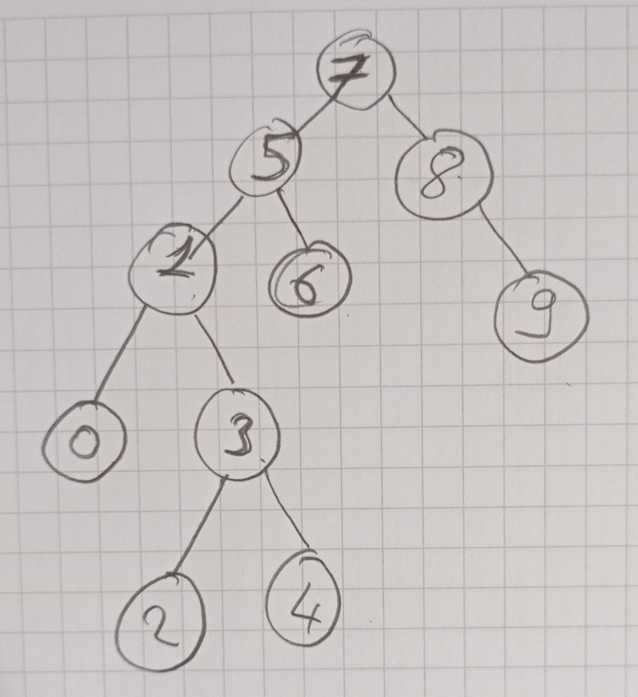

# Binary Search Tree Project
# [7, 5, 1, 8, 3, 6, 0, 9, 4, 2] -> Binary Search Tree

    7 -> We are beginning with root that number 7
    5 -> added left
    1 -> added left,left
    8 -> added right
    3 -> added left,left,right
    6 -> added left,right
    0 -> added left,left,left
    9 -> added right,right
    4 -> added left,left,right,right
    2 -> added left,left,right,left

